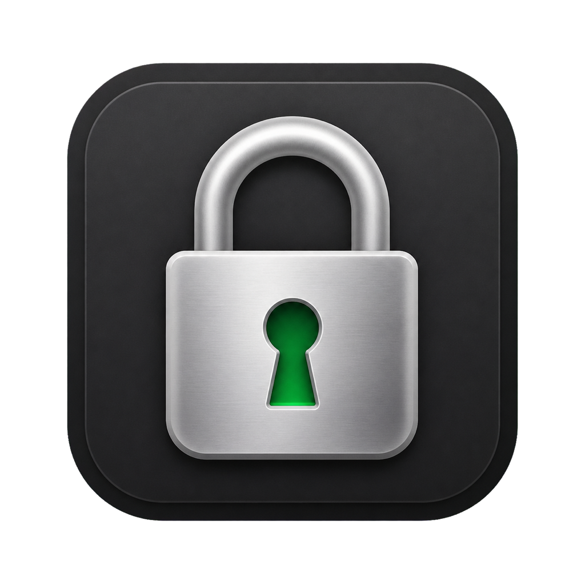
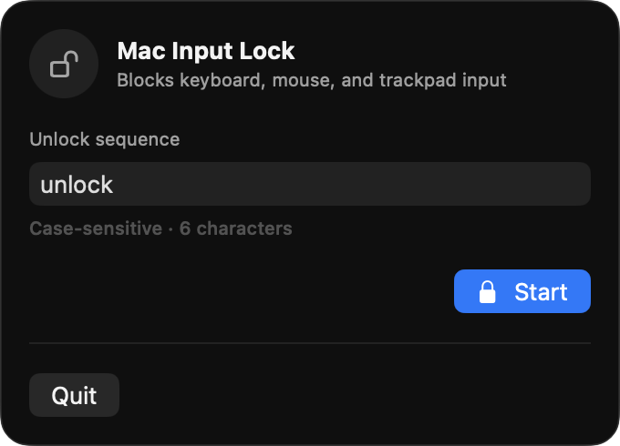

<p align="center">
  
</p>

# Mac Input Lock

Temporarily disable every keyboard, mouse, and trackpad connected to your Mac without interrupting video calls, playback, audio, camera, microphone, or anything already running.

Mac Input Lock is a focused, open-source menu-bar utility for toddlers, pets, keyboard cleaning, uninterrupted playback, and any situation where accidental input needs to stop. It has no accounts, analytics, network access, background service, or telemetry.

<p align="center">
  
</p>

## Requirements

- macOS 14 Sonoma or later
- Accessibility permission, used only to observe and suppress input events

## Install

### Official ready-to-install build

Purchase the official signed and notarized build for a one-time $9 payment at [macinputlock.com](https://macinputlock.com/#get-the-app). Open the DMG and drag **Mac Input Lock** to Applications.

The purchase supports Apple signing, notarization, compatibility testing, and continued maintenance. It includes household use and future updates to the official build, with no account, activation, or subscription.

### Build it yourself for free

Mac Input Lock remains completely open source under the MIT license. Developers can build the same app from source using the instructions below; no purchase is required.

On first use, enable **Mac Input Lock** in **System Settings → Privacy & Security → Accessibility**, then press Start again.

## Use

1. Open the lock icon in the menu bar.
2. Choose a case-sensitive unlock sequence containing at least one visible character. This is a convenience mechanism, not a password.
3. Press **Start**. A five-second countdown gives you time to cancel or remember the unlock sequence.
4. The app confirms that input is locked, remains visible briefly, and fades away. The menu bar says **Input Locked**.
5. Type the exact unlock sequence. Every keyboard, mouse, and trackpad immediately becomes responsive again.

For faster control, press **Control–Option–Command–D** (`⌃⌥⌘D`) anywhere to lock immediately without the countdown. The keys can all be pressed with the left hand. Press the same shortcut again while locked to restore input immediately. The shortcut is fixed so it remains predictable; the configured unlock sequence continues to work as an alternative.

The unlock sequence is stored only in local macOS preferences.

## Privacy and permissions

Accessibility permission is required because ordinary macOS applications cannot consume system-wide keyboard and pointer events. Mac Input Lock processes events locally, retains only enough recent characters to recognize the configured unlock sequence, and never records or transmits input.

The complete permission-sensitive implementation is in [`InputBlocker.swift`](Sources/MacInputLock/InputBlocker.swift). The app requests no camera, microphone, Screen Recording, file, notification, or network permission.

## Safety and limitations

- Test the unlock sequence before handing the Mac to a child.
- Test `⌃⌥⌘D` as well if you plan to use the instant shortcut. The Start button remains the safer handoff method because it includes a five-second countdown.
- Built-in and external keyboards, mice, trackpads, scrolling, dragging, and media-key events are blocked through the macOS session event stream.
- Hardware controls outside that event stream, including the physical power button, remain controlled by macOS.
- The normal Force Quit window is not useful while locked because local input is blocked.
- If the configured unlock sequence does not work, hold the physical power/Touch ID button until the Mac turns off, then restart it. This can discard unsaved work. Mac Input Lock does not automatically launch or relock after restart.

## Build from source

Xcode 16 or later is required.

```sh
swift test
SIGNING_IDENTITY=- ./Scripts/build-app.sh
open "dist/Mac Input Lock.app"
```

The build script uses an installed Developer ID Application, Apple Development, or Apple Distribution certificate when available and otherwise falls back to ad-hoc signing. Ad-hoc rebuilds may need to be removed and re-added in Accessibility Settings because their macOS identity changes.

Set `UNIVERSAL=1` to build both Apple Silicon and Intel slices. Release versions come from an exact `v*` Git tag; untagged builds use version `0.0.0`.

## Release process

Tagged releases are built, tested, signed with Hardened Runtime, notarized, stapled, and packaged as a DMG by GitHub Actions. Maintainers must configure the signing and notarization secrets documented in [CONTRIBUTING.md](CONTRIBUTING.md).

GitHub Releases are deliberately source-only and must never contain a prebuilt app or DMG. The official ready-to-install DMG is distributed exclusively through [macinputlock.com](https://macinputlock.com/#get-the-app); the build workflow retains a short-lived private copy for the maintainer to publish there. Every feature release must update and verify that protected fulfillment artifact before the feature is announced. Mac Input Lock does not include an automatic updater, so official-build users install newer releases manually.

## Contributing

Bug reports and focused pull requests are welcome. See [CONTRIBUTING.md](CONTRIBUTING.md) and [SECURITY.md](SECURITY.md).

## License

MIT. See [LICENSE](LICENSE).
