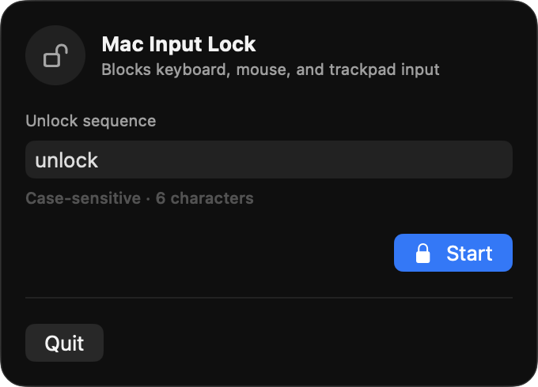

<p align="center">
  
</p>

# Mac Input Lock

Temporarily disable every keyboard, mouse, and trackpad connected to your Mac without interrupting video calls, playback, audio, camera, microphone, or anything already running.

Mac Input Lock is a focused, open-source menu-bar utility for toddlers, pets, keyboard cleaning, uninterrupted playback, and any situation where accidental input needs to stop. It has no accounts, analytics, background service, advertising, or telemetry. Its only network activity is checking for software updates when you request it or opt into automatic checks.

<p align="center">
  
</p>

## Requirements

- macOS 14 Sonoma or later
- Accessibility permission, used only to observe and suppress input events

## Install

### Official ready-to-install build

Purchase the official signed and notarized build for a one-time $9 payment at [macinputlock.com](https://macinputlock.com/#get-the-app). Open the DMG and drag **Mac Input Lock** to Applications.

The purchase supports Apple signing, notarization, compatibility testing, and continued maintenance. It includes household use and in-app updates to future official builds, with no account, activation, or subscription.

### Build it yourself for free

Mac Input Lock remains completely open source under the MIT license. Developers can build the same app from source using the instructions below; no purchase is required.

On first use, enable **Mac Input Lock** in **System Settings → Privacy & Security → Accessibility**, then press Start again.

## Use

1. Open the lock icon in the menu bar.
2. Choose a case-sensitive unlock sequence containing at least one visible character. This is a convenience mechanism, not a password.
3. Press **Start**. A five-second countdown gives you time to cancel or remember the unlock sequence.
4. A large red closing-padlock animation confirms that input is locked, then fades away. The menu bar says **Input Locked**.
5. Type the exact unlock sequence. Every keyboard, mouse, and trackpad immediately becomes responsive again, confirmed by a green opening-padlock animation.

If you cannot see the menu-bar padlock, open **Mac Input Lock** again from Applications, Launchpad, or Spotlight. Reopening the already-running app always shows its full control window. The control window also includes an optional **Show Mac Input Lock in the Dock** setting for people who want a permanent second way to find it.

For faster control, press **Control–Option–Command–D** (`⌃⌥⌘D`) anywhere to lock immediately without the countdown. The keys can all be pressed with the left hand. Press the same shortcut again while locked to restore input immediately. The shortcut is fixed so it remains predictable; the configured unlock sequence continues to work as an alternative.

The unlock sequence is stored only in local macOS preferences.

## Updates

Choose **Check for Updates…** in the Mac Input Lock controls at any time. On the second launch, the app asks whether it may check automatically; declining leaves manual checks available. Automatic checks run at most once per day, and updates are never installed or used to relaunch the app while input is locking, locked, or showing the restored confirmation.

Version 1.3.0 is the bridge release that adds in-app updates. People using an earlier version must install 1.3.0 or later manually once. Future releases can then be installed from inside the app.

## Privacy and permissions

Accessibility permission is required because ordinary macOS applications cannot consume system-wide keyboard and pointer events. Mac Input Lock processes events locally, retains only enough recent characters to recognize the configured unlock sequence, and never records or transmits input.

The complete permission-sensitive implementation is in [`InputBlocker.swift`](Sources/MacInputLock/InputBlocker.swift). The app requests no camera, microphone, Screen Recording, file, or notification permission.

Update checks use [Sparkle](https://sparkle-project.org/) to request a public, signed update feed from GitHub. Sparkle's optional system profiling is disabled. Mac Input Lock sends no input, unlock sequence, identifier, account information, or usage data. As with any ordinary web request, GitHub receives standard connection metadata such as an IP address and user agent. Update archives and the feed are cryptographically signed, and an update is verified before extraction.

## Safety and limitations

- Test the unlock sequence before handing the Mac to a child.
- Test `⌃⌥⌘D` as well if you plan to use the instant shortcut. The Start button remains the safer handoff method because it includes a five-second countdown.
- Built-in and external keyboards, mice, trackpads, scrolling, dragging, and media-key events are blocked through the macOS session event stream.
- Hardware controls outside that event stream, including the physical power button, remain controlled by macOS.
- The normal Force Quit window is not useful while locked because local input is blocked.
- If the configured unlock sequence does not work, hold the physical power/Touch ID button until the Mac turns off, then restart it. This can discard unsaved work. Mac Input Lock does not automatically launch or relock after restart.

## Build from source

Xcode 16 or later is required.

```sh
swift test
SIGNING_IDENTITY=- ./Scripts/build-app.sh
open "dist/Mac Input Lock.app"
```

The build script uses an installed Developer ID Application, Apple Development, or Apple Distribution certificate when available and otherwise falls back to ad-hoc signing. Ad-hoc rebuilds may need to be removed and re-added in Accessibility Settings because their macOS identity changes.

Set `UNIVERSAL=1` to build both Apple Silicon and Intel slices. Release versions come from an exact `v*` Git tag; untagged builds use version `0.0.0`.

## Release process

Tagged releases are built, tested, signed with Hardened Runtime, notarized, stapled, and packaged as a DMG by GitHub Actions. Maintainers must configure the signing, notarization, and update-signing secrets documented in [CONTRIBUTING.md](CONTRIBUTING.md).

GitHub Releases contain source archives plus the public, EdDSA-signed ZIP and appcast required for in-app updates. The polished ready-to-install DMG remains distributed through [macinputlock.com](https://macinputlock.com/#get-the-app); the workflow retains it as a short-lived private artifact for the maintainer to publish there. Every feature release must update and verify that protected fulfillment artifact before the feature is announced.

Sparkle and its bundled third-party components retain their original license notices inside every application bundle.

## Contributing

Bug reports and focused pull requests are welcome. See [CONTRIBUTING.md](CONTRIBUTING.md) and [SECURITY.md](SECURITY.md).

## License

MIT. See [LICENSE](LICENSE).
